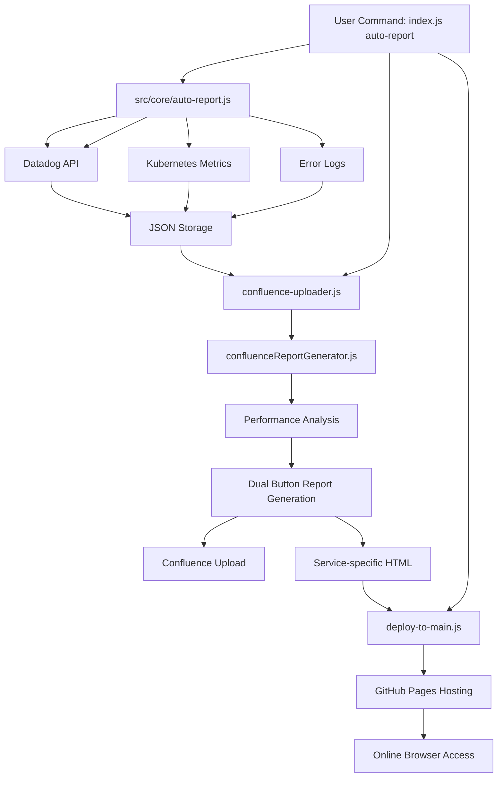

# Automated Performance Reporting System

## Overview
Complete end-to-end automated system that fetches Datadog performance metrics, generates professional Confluence reports with interactive visualizations, and hosts reports on GitHub Pages for instant browser access.

## 🚀 Quick Start (One Command)

### Complete Automation
```bash
node index.js auto-report --from 'Feb 3, 12:33 am' --to 'Feb 3, 12:36 am' --service 'stardust-activity-log-service'
```

**What it does automatically:**
1. ✅ **Fetches metrics** from Datadog APIs (endpoints, containers, errors)
2. ✅ **Generates HTML** reports with interactive Chart.js visualizations  
3. ✅ **Uploads to Confluence** with both Download + View in Browser buttons
4. ✅ **Deploys to GitHub Pages** for instant online access

**Result:** Professional reports available both in Confluence and online within 2 minutes!

## Setup Instructions

### Prerequisites
- Node.js (v14 or higher)
- npm
- Datadog API access
- Confluence API access
- GitHub repository for Pages hosting

### 1. Install Dependencies
```bash
npm install
```

### 2. Environment Configuration
Create a `.env` file in the project root:
```env
# Datadog Configuration
DD_API_KEY=your_datadog_api_key
DD_APP_KEY=your_datadog_app_key
DD_SITE=datadoghq.com

# Confluence Configuration  
CONFLUENCE_BASE_URL=https://yourcompany.atlassian.net
CONFLUENCE_USER_EMAIL=your_email@company.com
CONFLUENCE_API_TOKEN=your_confluence_api_token
CONFLUENCE_SPACE_KEY=your_space_key

# GitHub Pages Configuration
GITHUB_PAGES_BASE_URL=https://your-username.github.io
GITHUB_USERNAME=your-github-username
GITHUB_REPO_NAME=your-repo-name

# Environment
ENV=staging

# Load Pattern Configuration
LOAD_PATTERN=To simulate the throughput in Five steps, starts with 1 req/sec for 6 mins then increased to 2 req/sec for the next 6 mins, and finally reaching to 5 req/sec for last 6 mins.
```

⚠️ **Important**: Never commit the `.env` file to version control as it contains sensitive API keys.

## Features

### 🚀 Complete Automation
- **Single Command**: `node auto-report.js` runs entire workflow
- **Zero Manual Steps**: From Datadog → Confluence → GitHub Pages automatically
- **CLI Parameters**: Flexible time ranges and service selection
- **Error Handling**: Automatic rollback and clear error messages

### ✅ Automated Data Collection
- Fetches metrics from Datadog API for any service
- Collects P95/P99 latency, request rates, and error rates
- Container/Pod metrics from Kubernetes
- Error analysis with OOM detection
- Generates time series data (6 data points per endpoint)
- Supports custom date/time ranges

### 🌐 Dual Access Reports
- **📥 Download Interactive Report**: Confluence attachment for offline access
- **🌐 View in Browser**: Instant GitHub Pages hosting for stakeholder sharing
- **Service-specific URLs**: Each report gets unique GitHub Pages URL
- **Professional Styling**: Consistent branding across both formats

### ✅ Professional Confluence Integration
- Auto-uploads formatted reports to Confluence
- Clean, professional styling with badges and color coding
- Expandable sections for individual endpoints
- Interactive charts embedded natively
- Automatic page creation or updates (versioned)

### ✅ Interactive HTML Reports
- Standalone HTML with Chart.js visualizations
- Real-time hover tooltips for data points  
- Scatter plot: P95 vs Request Rate correlation
- Time series charts for each endpoint
- Fully portable - hosted on GitHub Pages automatically

### 🔧 GitHub Pages Integration
- **Automatic Deployment**: Reports deploy to GitHub Pages instantly
- **Environment Variables**: Configurable GitHub Pages URL
- **Main Branch Hosting**: Direct deployment from main branch
- **Dual File Strategy**: Service-specific + generic filenames

## Quick Start

### 🎯 Complete Automation (Recommended)
```bash
node index.js auto-report --from 'Jan 14, 1:51 pm' --to 'Jan 14, 2:21 pm' --service 'stardust-communication-service'
```

**Parameters:**
- `--from`: Start date/time (e.g., 'Jan 13, 1:25 pm')
- `--to`: End date/time (e.g., 'Jan 13, 1:56 pm')  
- `--service`: Service name (e.g., 'stardust-activity-log-service')

**Complete Output:**
- ✅ Datadog metrics collected (endpoints, containers, errors)
- ✅ Interactive HTML generated in `html-reports/` folder
- ✅ Confluence page updated with download + browser view buttons
- ✅ GitHub Pages deployment with unique service URLs

### ⚙️ Manual Steps (Advanced Users)

#### 1. Fetch Metrics Only
```bash
node index.js fetch-metrics --from 'Jan 3, 2:37 pm' --to 'Jan 3, 3:09 pm' --service 'stardust-activity-log-service'
```

#### 2. Upload to Confluence Only
```bash
node index.js upload-confluence
```

#### 3. Generate Interactive Report Only
```bash
node index.js generate-html
```

**Individual Step Outputs:**
- **Step 1**: JSON files saved to `./reports/` directory
- **Step 2**: Confluence page with dual-button functionality  
- **Step 3**: GitHub Pages hosting with environment-based URLs

## Report Components

### Confluence Report Sections

#### 📊 Header
- **Service Badge**: Blue clickable badge linking to Datadog dashboard
- **Environment Badge**: Green badge (STAGING/PRODUCTION)

#### 🎯 Objective
Brief description of performance testing goals

#### 📋 Test Scope & Design
- **Start Time**: Auto-extracted from metrics
- **End Time**: Auto-extracted from metrics
- **Test Type**: Stress Test (configurable)
- **Duration**: Auto-calculated
- **Design**: Load pattern description (currently static)

#### 📊 Endpoint Performance Summary
Sortable table with:
- Resource Name (endpoint path)
- Requests (total hits)
- P95 Latency
- P99 Latency
- Request Rate
- Errors
- Error Rate

#### 📈 P95 Latency Time Series Analysis
- Scatter plot showing P95 vs Request Rate
- Download link to interactive HTML report

#### 📊 Individual Endpoint Time Series
Expandable sections for each endpoint:
- P95 Latency chart over time (700px width)
- Request Rate chart over time (700px width)
- Both charts with 280px height for optimal Confluence fit

### Interactive HTML Features
- **Scatter Plot**: Visualize latency vs request rate correlation
- **Dual Time Series**: P95 latency + request rate per endpoint
- **Hover Tooltips**: Show exact values on mouse over
- **Responsive Design**: Works on desktop and mobile
- **Color Coded**: Each endpoint has unique color

## Framework Architecture

### 🏗️ System Design Overview

```
Auto Performance Report Framework/
├── 📱 Main Entry Point
│   └── index.js                       # CLI router and command dispatcher
│
├── 📁 src/                            # Organized source code
│   ├── 🚀 core/                       # Main automation logic
│   │   └── auto-report.js            # Complete workflow orchestrator
│   │
│   ├── 📊 fetchers/                   # Data collection modules
│   │   ├── fetchdatadogmetrics.js    # Main Datadog API orchestrator
│   │   ├── fetch-container-metrics.js # Kubernetes pod/container metrics
│   │   └── fetch-error-metrics.js    # Error analysis and OOM detection
│   │
│   ├── 📤 generators/                 # Report generation
│   │   ├── confluence-uploader.js    # Confluence API + dual buttons
│   │   └── generate-full-interactive-report.js # Interactive HTML generator
│   │
│   ├── 🔄 scripts/                    # Core processing engines
│   │   └── confluenceReportGenerator.js # Report analysis and formatting
│   │
│   └── 🛠️ utils/                      # Helper utilities (future expansion)
│
├── 🌐 GitHub Pages Hosting
│   └── html-reports/                   # Auto-deployed interactive reports
│       ├── [service]-report-[date].html # Service-specific URLs
│       └── complete-interactive-report.html # Generic download file
│
├── 📁 Data Storage
│   └── reports/                        # Metrics repository
│       ├── [service]_endpoint_metrics_table.json
│       ├── [service]_container_metrics.json
│       └── [service]_error_metrics.json
│
├── 🔧 Configuration Layer
│   ├── .env                           # API credentials + GitHub Pages URL
│   ├── package.json                   # Dependencies & scripts
│   └── .gitignore                     # Security exclusions
│
└── 📖 Documentation
    └── README.md                      # Complete setup guide
```

### 🔄 Data Flow Architecture



### 🎯 Automation Features
- **Single Command**: Complete end-to-end automation
- **Environment Variables**: GitHub Pages URL configuration  
- **Dual File Strategy**: Generic download + service-specific online URLs
- **Git Integration**: Automatic commit and push to main branch
- **Error Handling**: Graceful fallbacks and informative error messages

### Color Scheme
- **Service Badge**: `#0052CC` (Blue background, white text)
- **Environment Badge**: `#00875A` (Green background, white text)
- **Section Headers**: `#0052CC` (Blue background, white text)
- **Charts**: 10 distinct colors for endpoints

## Key Features

### ✅ Auto-Detection
- Automatically finds latest metrics file
- No need to specify input file paths

### ✅ Dynamic Service Support
- Works with any Datadog service
- Interactive HTML auto-generates for current service
- Service-specific endpoints detected automatically

### ✅ Professional Styling
- Confluence Storage Format (XHTML) compliant
- Consistent badge styling across all sections
- Bold headers with color-coded badges
- Proper chart sizing (700px width) for page fit

### ✅ Error Handling
- Validates configuration before running
- Provides helpful error messages
- Graceful fallbacks for missing data

## Chart Specifications

### QuickChart.io (Confluence Static Charts)
- **Width**: 700px
- **Height**: 280px
- **Type**: Line charts with time series
- **Format**: PNG images embedded via URL

### Chart.js (Interactive HTML)
- **Version**: 3.9.1
- **Adapter**: chartjs-adapter-date-fns 2.0.0
- **Charts**: Scatter + Line (dual axis)
- **Interactivity**: Hover tooltips, legends

## Metrics Collected

### Per Endpoint
- **P95 Latency**: 95th percentile response time
- **P99 Latency**: 99th percentile response time
- **Request Rate**: Hits per second
- **Total Requests**: Total hits during time range
- **Errors**: Error count
- **Error Rate**: Percentage of failed requests

### Time Series Data
- **Data Points**: 180 per endpoint
- **Interval**: ~10 seconds between points
- **Metrics**: Both P95 latency and request rate over time

## Use Cases

### 1. Load Testing Reports
Run load test → Fetch metrics → Auto-generate Confluence report

### 2. Performance Monitoring
Regular snapshots of service performance with visual trends

### 3. Regression Analysis
Compare multiple test runs by generating separate reports

### 4. Stakeholder Communication
Share professional reports with management and teams

## Workflow Example

### 🚀 New Streamlined Workflow
```bash
# Step 1: Run your load test (external tool like JMeter, K6, etc.)

# Step 2: Generate complete report automatically
node index.js auto-report --from 'Jan 13, 1:25 pm' --to 'Jan 13, 1:56 pm' --service 'stardust-closing-requirements-service'

# Done! Check both:
# 📋 Confluence: Updated page with download + browser view buttons  
# 🌐 GitHub Pages: Live report at https://your-pages-url.github.io/html-reports/service-report-date.html
```

### 📊 What You Get
- **Confluence Report**: Professional page with both download and online viewing options
- **GitHub Pages**: Instant browser access for stakeholders without Confluence accounts
- **Dual URLs**: Download for offline analysis + Online for immediate sharing
- **Version Control**: All reports tracked in Git history

## Limitations & Notes

### Static Elements
- Test Type: Currently hardcoded as "Stress Test"
- Design Pattern: Currently shows "1 → 2 → 5 req/sec" static pattern
- These could be made dynamic based on actual load pattern analysis

### Confluence Constraints
- Some HTML styling not supported in macro titles
- Chart width optimization needed for different page layouts
- Attachments replace previous versions (not versioned)

### Datadog API
- Rate limits apply to API calls
- Requires valid API and APP keys
- Service names must match exactly

## Key Benefits

### 🚀 Complete Automation
- **Zero Manual Steps**: One command handles entire workflow
- **Dual Access**: Both Confluence download and GitHub Pages browser viewing
- **Professional Output**: Consistent styling across all output formats
- **Version Control**: All reports tracked in Git with automatic deployment

### ⚡ Speed & Efficiency
- **2-Minute Turnaround**: From metrics to live reports in under 2 minutes
- **Stakeholder Ready**: Instant sharing via GitHub Pages URLs
- **Mobile Friendly**: Interactive charts work on all devices
- **Offline Capable**: Download option for offline analysis

### 🔧 Enterprise Ready
- **Environment Variables**: Easy configuration management
- **Error Handling**: Robust error recovery and informative messages
- **API Rate Limiting**: Handles Datadog API constraints gracefully
- **Security**: Sensitive credentials stored in .env (never committed)

## Current Status

**Version**: v2.0 (Production Ready)  
**Last Updated**: February 2026  
**Status**: ✅ Fully Automated End-to-End System

### Recent Enhancements
- ✅ Complete single-command automation
- ✅ GitHub Pages integration with environment variables
- ✅ Dual-button Confluence reports (Download + View in Browser)
- ✅ Service-specific URL generation  
- ✅ Main branch deployment (no gh-pages needed)
- ✅ Improved error handling and git conflict resolution

## Dependencies

```json
{
  "axios": "^1.6.0",
  "dotenv": "^16.0.0"
}
```

## Technologies Used
- **Node.js**: Script execution & automation
- **Datadog API**: Metrics collection
- **Confluence REST API**: Report publishing  
- **GitHub Pages**: Static site hosting
- **Chart.js**: Interactive visualizations
- **Git**: Version control & automated deployment

---

**Created**: January 2026  
**Status**: Production Ready ✅  
**Maintainer**: Performance Testing Team
