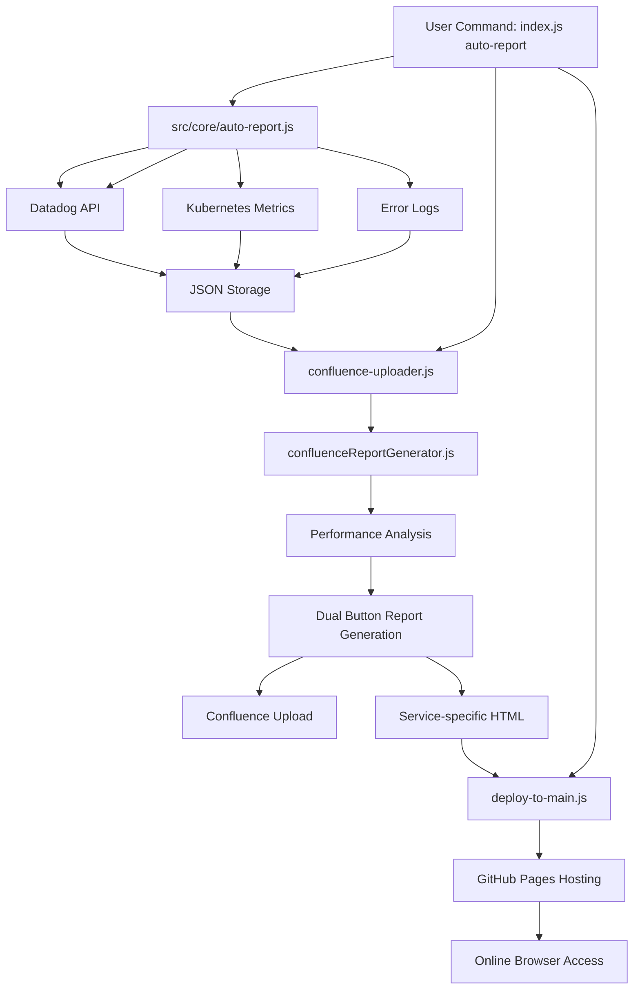

# Automated Performance Reporting System

## Overview
Complete end-to-end automated system that fetches Datadog performance metrics, generates professional Confluence reports with interactive visualizations, and hosts reports on GitHub Pages for instant browser access.

## 🚀 Quick Start (One Command)

### Complete Automation
```bash
node index.js auto-report --from 'Feb 3, 12:33 am' --to 'Feb 3, 12:36 am' --service 'stardust-activity-log-service'
```

**What it does automatically:**
1. ✅ **Fetches metrics** from Datadog APIs (endpoints, containers, errors)
2. ✅ **Generates HTML** reports with interactive Chart.js visualizations  
3. ✅ **Uploads to Confluence** with both Download + View in Browser buttons
4. ✅ **Deploys to GitHub Pages** for instant online access

**Result:** Professional reports available both in Confluence and online within 2 minutes!

## Setup Instructions

### Prerequisites
- Node.js (v14 or higher)
- npm
- Datadog API access
- **Confluence Cloud** account with API access
- GitHub repository with Pages enabled

### 1. Install Dependencies
```bash
npm install
```

### 2. Environment Configuration
Create a `.env` file in the project root:
```env
# Datadog Configuration
DD_API_KEY=your_datadog_api_key
DD_APP_KEY=your_datadog_app_key
DD_SITE=datadoghq.com

# Confluence Configuration  
CONFLUENCE_BASE_URL=https://yourcompany.atlassian.net
CONFLUENCE_USER_EMAIL=your_email@company.com
CONFLUENCE_API_TOKEN=your_confluence_api_token
CONFLUENCE_SPACE_KEY=your_space_key
# Optional: Parent folder ID for organizing reports (if not set, pages created at root)
CONFLUENCE_PARENT_FOLDER_ID=your_parent_folder_id

# GitHub Pages Configuration
GITHUB_PAGES_BASE_URL=https://your-username.github.io
GITHUB_USERNAME=your-github-username
GITHUB_REPO_NAME=your-repo-name

# Environment
ENV=staging

# Load Pattern Configuration
LOAD_PATTERN=To simulate the throughput in Five steps, starts with 1 req/sec for 6 mins then increased to 2 req/sec for the next 6 mins, and finally reaching to 5 req/sec for last 6 mins.
```

⚠️ **Important Notes:**
- Never commit the `.env` file to version control as it contains sensitive API keys
- Ensure there are **no extra spaces** in environment variable values (e.g., `URL=https://example.com` not `URL= https://example.com`)
- The `GITHUB_PAGES_BASE_URL` and `GITHUB_REPO_NAME` are used to dynamically generate report URLs
- URLs are generated at runtime, so changes to `.env` take effect immediately on next upload

### 3. Confluence Parent Folder Configuration (Optional)

By default, reports are created at the root of your Confluence space. To organize reports in a specific folder:

#### Finding Your Parent Folder ID

1. **Navigate to your target folder** in Confluence (e.g., "Performance-Testing" > "SRP-Performance-Reports")
2. **Open the folder page** and look at the URL:
   ```
   https://yourcompany.atlassian.net/wiki/spaces/fa/pages/2570715685/SRP-Performance-Reports
                                                               ^^^^^^^^^^
                                                               This is your folder ID
   ```
3. **Copy the page ID** (the number in the URL)
4. **Add to `.env` file**:
   ```env
   CONFLUENCE_PARENT_FOLDER_ID=2570715685
   ```

#### How It Works

- **New Reports**: Automatically created under the specified parent folder
- **Existing Reports**: Automatically moved to the correct folder when updated
- **No Configuration**: Reports created at root of the Confluence space if not set

**Example Structure:**
```
📁 Performance-Testing (page ID: 851247125)
  └── 📁 SRP-Performance-Reports (page ID: 2570715685) ← Set this as CONFLUENCE_PARENT_FOLDER_ID
      ├── 📄 Operator Agent Service Performance Report - Jan 16, 2026 4:14 PM
      ├── 📄 Stardust Task Service Performance Report - Jan 9, 2026 3:00 PM
      └── 📄 Stardust Transaction Participant Service Performance Report - Jan 9, 2026 1:53 PM
```

## Features

### 🚀 Complete Automation
- **Single Command**: `node auto-report.js` runs entire workflow
- **Zero Manual Steps**: From Datadog → Confluence → GitHub Pages automatically
- **CLI Parameters**: Flexible time ranges and service selection
- **Error Handling**: Automatic rollback and clear error messages

### ✅ Automated Data Collection
- Fetches metrics from Datadog API for any service
- Collects P95/P99 latency, request rates, and error rates
- Container/Pod metrics from Kubernetes
- Error analysis with OOM detection
- Generates time series data (6 data points per endpoint)
- Supports custom date/time ranges

### 🌐 Dual Access Reports
- **📥 Download Interactive Report**: Confluence attachment for offline access
- **🌐 View in Browser**: Instant GitHub Pages hosting for stakeholder sharing
- **Service-specific URLs**: Each report gets unique GitHub Pages URL
- **Professional Styling**: Consistent branding across both formats

### ✅ Professional Confluence Integration
- Auto-uploads formatted reports to Confluence Cloud
- **Confluence Cloud Compatible**: Uses native macros (panel, status, info, tip, warning, note)
- **No Inline CSS**: Fully compatible with Confluence Cloud's strict content policy
- Expandable sections for individual endpoints
- Interactive charts embedded natively
- Automatic page creation or updates (versioned)

### ✅ Interactive HTML Reports
- Standalone HTML with Chart.js visualizations
- Real-time hover tooltips for data points  
- Scatter plot: P95 vs Request Rate correlation
- Time series charts for each endpoint
- Fully portable - hosted on GitHub Pages automatically

### 🔧 GitHub Pages Integration
- **Automatic Deployment**: Reports deploy to GitHub Pages instantly
- **Environment Variables**: Fully configurable GitHub Pages base URL and repo name
- **Dynamic URL Generation**: URLs generated from `.env` configuration at runtime
- **Main Branch Hosting**: Direct deployment from main branch
- **Dual File Strategy**: Service-specific + generic filenames
- **No Hardcoded URLs**: All GitHub Pages URLs read from environment variables

## Quick Start

### 🎯 Complete Automation (Recommended)
```bash
node index.js auto-report --from 'Jan 14, 1:51 pm' --to 'Jan 14, 2:21 pm' --service 'stardust-communication-service'
```

**Parameters:**
- `--from`: Start date/time (e.g., 'Jan 13, 1:25 pm')
- `--to`: End date/time (e.g., 'Jan 13, 1:56 pm')  
- `--service`: Service name (e.g., 'stardust-activity-log-service')

**Complete Output:**
- ✅ Datadog metrics collected (endpoints, containers, errors)
- ✅ Interactive HTML generated in `html-reports/` folder
- ✅ Confluence page updated with download + browser view buttons
- ✅ GitHub Pages deployment with unique service URLs

### ⚙️ Manual Steps (Advanced Users)

#### 1. Fetch Metrics Only
```bash
node index.js fetch-metrics --from 'Jan 3, 2:37 pm' --to 'Jan 3, 3:09 pm' --service 'stardust-activity-log-service'
```

#### 2. Upload to Confluence Only
```bash
node index.js upload-confluence
```

#### 3. Generate Interactive Report Only
```bash
node index.js generate-html
```

**Individual Step Outputs:**
- **Step 1**: JSON files saved to `./reports/` directory
- **Step 2**: Confluence page with dual-button functionality  
- **Step 3**: GitHub Pages hosting with environment-based URLs

## Report Components

### Confluence Report Sections

**Note**: All sections use Confluence Cloud native macros for compatibility

#### 📊 Header
- **Service Name**: Clickable HTML link to Datadog dashboard (displays full service name)
- **Environment Badge**: Green status macro (STAGING/PRODUCTION)
- **Macro Used**: Standard `<table>` layout with HTML links

#### 🎯 Objective
- Brief description of performance testing goals and methodology
- **Macro Used**: `panel` (blue header with info content)

#### 📋 Test Scope & Design
- **Test Environment**: Auto-extracted from configuration
- **Test Execution time**: Auto-extracted from metrics (optimized column width for single-line display)
- **Test Type**: Stress Test (configurable)
- **Duration**: Auto-calculated
- **Design**: Load pattern description with highlighted request rates
- **Macro Used**: `panel` (blue header) with clean table layout

#### 📊 Endpoint Performance Summary
Sortable table with:
- Resource Name (endpoint path)
- Requests (total hits)
- P95 Latency
- P99 Latency
- Request Rate
- Errors
- Error Rate
- **Macro Used**: `panel` (blue header) with `info` macro for table description

#### 📈 P95 Latency Time Series Analysis
- Download link to interactive HTML report (Confluence attachment)
- View in Browser link (GitHub Pages)
- **Macro Used**: `panel` (blue header) with `note` macro for download instructions

#### 💡 Overall Observations & Recommendations
- Performance status badge (color-coded based on findings)
- Key findings with bullet points
- Actionable recommendations
- **Macro Used**: `panel` (purple header) with `status` macro for performance badge

#### 📊 Individual Endpoint Time Series
Expandable sections for each endpoint:
- P95 Latency chart over time (700px width)
- Request Rate chart over time (700px width)
- Both charts with 280px height for optimal Confluence fit
- **Macro Used**: `expand` macro for collapsible endpoint sections

### Interactive HTML Features
- **Scatter Plot**: Visualize latency vs request rate correlation
- **Dual Time Series**: P95 latency + request rate per endpoint
- **Hover Tooltips**: Show exact values on mouse over
- **Responsive Design**: Works on desktop and mobile
- **Color Coded**: Each endpoint has unique color

## Framework Architecture

### 🏗️ System Design Overview

```
Auto Performance Report Framework/
├── 📱 Main Entry Point
│   └── index.js                       # CLI router and command dispatcher
│
├── 📁 src/                            # Organized source code
│   ├── 🚀 core/                       # Main automation logic
│   │   └── auto-report.js            # Complete workflow orchestrator
│   │
│   ├── 📊 fetchers/                   # Data collection modules
│   │   ├── fetchdatadogmetrics.js    # Main Datadog API orchestrator
│   │   ├── fetch-container-metrics.js # Kubernetes pod/container metrics
│   │   └── fetch-error-metrics.js    # Error analysis and OOM detection
│   │
│   ├── 📤 generators/                 # Report generation
│   │   ├── confluence-uploader.js    # Confluence API + dual buttons
│   │   └── generate-full-interactive-report.js # Interactive HTML generator
│   │
│   ├── 🔄 scripts/                    # Core processing engines
│   │   └── confluenceReportGenerator.js # Report analysis and formatting
│   │
│   └── 🛠️ utils/                      # Helper utilities (future expansion)
│
├── 🌐 GitHub Pages Hosting
│   └── html-reports/                   # Auto-deployed interactive reports
│       ├── [service]-report-[date].html # Service-specific URLs
│       └── complete-interactive-report.html # Generic download file
│
├── 📁 Data Storage
│   └── reports/                        # Metrics repository
│       ├── [service]_endpoint_metrics_table.json
│       ├── [service]_container_metrics.json
│       └── [service]_error_metrics.json
│
├── 🔧 Configuration Layer
│   ├── .env                           # API credentials + GitHub Pages URL
│   ├── package.json                   # Dependencies & scripts
│   └── .gitignore                     # Security exclusions
│
└── 📖 Documentation
    └── README.md                      # Complete setup guide
```

### 🔄 Data Flow Architecture



### 🎯 Automation Features
- **Single Command**: Complete end-to-end automation
- **Environment Variables**: GitHub Pages URL configuration  
- **Dual File Strategy**: Generic download + service-specific online URLs
- **Git Integration**: Automatic commit and push to main branch
- **Error Handling**: Graceful fallbacks and informative error messages

### Confluence Cloud Styling

**Native Macros Used:**
- **`panel`**: Section headers with colored backgrounds (blue: #0052CC, purple: #632CA6)
- **`status`**: Colored badges for environment, performance status
- **`info`**: Informational blue boxes for descriptions
- **`tip`**: Green boxes for recommendations
- **`warning`**: Yellow/red boxes for OOM events
- **`note`**: Gray boxes for download instructions
- **`expand`**: Collapsible sections for detailed endpoint data

**Styling Details:**
- **Panel Headers**: Blue (`#0052CC`) for main sections, purple for observations
- **Status Badges**: Color-coded (Blue for info, Green for environment, Yellow/Red for warnings)
- **No Inline CSS**: Fully compliant with Confluence Cloud restrictions
- **Interactive Charts**: 10 distinct colors for endpoint visualization
- **Clean Tables**: Standard HTML tables without inline styles

## Key Features

### ✅ Auto-Detection
- Automatically finds latest metrics file
- No need to specify input file paths

### ✅ Dynamic Service Support
- Works with any Datadog service
- Interactive HTML auto-generates for current service
- Service-specific endpoints detected automatically

### ✅ Professional Styling
- **Confluence Cloud Native**: Uses only approved Confluence macros
- **Storage Format (XHTML)**: Fully compliant with Confluence Cloud standards
- **Macro-Based Design**: Panel, status, info, tip, warning, and note macros
- **Consistent Branding**: Color-coded sections without inline CSS
- **Responsive Tables**: Optimized column widths for readability
- **Proper Chart Sizing**: 700px width charts for optimal page fit

### ✅ Error Handling
- Validates configuration before running
- Provides helpful error messages
- Graceful fallbacks for missing data

## Chart Specifications

### QuickChart.io (Confluence Static Charts)
- **Width**: 700px
- **Height**: 280px
- **Type**: Line charts with time series
- **Format**: PNG images embedded via URL

### Chart.js (Interactive HTML)
- **Version**: 3.9.1
- **Adapter**: chartjs-adapter-date-fns 2.0.0
- **Charts**: Scatter + Line (dual axis)
- **Interactivity**: Hover tooltips, legends

## Metrics Collected

### Per Endpoint
- **P95 Latency**: 95th percentile response time
- **P99 Latency**: 99th percentile response time
- **Request Rate**: Hits per second
- **Total Requests**: Total hits during time range
- **Errors**: Error count
- **Error Rate**: Percentage of failed requests

### Time Series Data
- **Data Points**: 180 per endpoint
- **Interval**: ~10 seconds between points
- **Metrics**: Both P95 latency and request rate over time

## Use Cases

### 1. Load Testing Reports
Run load test → Fetch metrics → Auto-generate Confluence report

### 2. Performance Monitoring
Regular snapshots of service performance with visual trends

### 3. Regression Analysis
Compare multiple test runs by generating separate reports

### 4. Stakeholder Communication
Share professional reports with management and teams

## Workflow Example

### 🚀 New Streamlined Workflow
```bash
# Step 1: Run your load test (external tool like JMeter, K6, etc.)

# Step 2: Generate complete report automatically
node index.js auto-report --from 'Jan 13, 1:25 pm' --to 'Jan 13, 1:56 pm' --service 'stardust-closing-requirements-service'

# Done! Check both:
# 📋 Confluence: Updated page with download + browser view buttons  
# 🌐 GitHub Pages: Live report at https://your-pages-url.github.io/html-reports/service-report-date.html
```

### 📊 What You Get
- **Confluence Report**: Professional page with both download and online viewing options
- **GitHub Pages**: Instant browser access for stakeholders without Confluence accounts
- **Dual URLs**: Download for offline analysis + Online for immediate sharing
- **Version Control**: All reports tracked in Git history

## Limitations & Notes

### Static Elements
- Test Type: Currently hardcoded as "Stress Test"
- Design Pattern: Currently shows "1 → 2 → 5 req/sec" static pattern
- These could be made dynamic based on actual load pattern analysis

### Confluence Cloud Constraints
- **No Inline CSS**: Confluence Cloud strips all inline CSS styles
- **Macro-Only Styling**: Must use native Confluence macros (panel, status, info, etc.)
- **Status Macro Limitations**: Character limits and cannot be made clickable directly
- **Chart Width**: Optimized to 700px for best page fit
- **Attachments**: Replace previous versions (not versioned independently)

### Datadog API
- Rate limits apply to API calls
- Requires valid API and APP keys
- Service names must match exactly

## Key Benefits

### 🚀 Complete Automation
- **Zero Manual Steps**: One command handles entire workflow
- **Dual Access**: Both Confluence download and GitHub Pages browser viewing
- **Professional Output**: Consistent styling across all output formats
- **Version Control**: All reports tracked in Git with automatic deployment

### ⚡ Speed & Efficiency
- **2-Minute Turnaround**: From metrics to live reports in under 2 minutes
- **Stakeholder Ready**: Instant sharing via GitHub Pages URLs
- **Mobile Friendly**: Interactive charts work on all devices
- **Offline Capable**: Download option for offline analysis

### 🔧 Enterprise Ready
- **Environment Variables**: Easy configuration management
- **Error Handling**: Robust error recovery and informative messages
- **API Rate Limiting**: Handles Datadog API constraints gracefully
- **Security**: Sensitive credentials stored in .env (never committed)

## Confluence Cloud Migration

### ⚠️ Important: Confluence Cloud Compatibility

This system is **fully compatible with Confluence Cloud**, which has stricter content policies than Confluence Server:

**Key Changes:**
- ✅ **No Inline CSS**: All inline CSS styles have been removed
- ✅ **Native Macros Only**: Uses Confluence-approved macros (`panel`, `status`, `info`, `tip`, `warning`, `note`)
- ✅ **Service Name**: Clickable HTML link (blue by default, without custom background)
- ✅ **Panel Macros**: All section headers use panel macros with colored backgrounds
- ✅ **Status Badges**: Environment and performance status badges use native status macros
- ✅ **Table Formatting**: Clean table layouts without inline styles

**Migration Details:**
- **Service Link**: Uses standard HTML `<a>` tag (Confluence auto-styles links in blue)
- **Sections**: Each section wrapped in `panel` macro with colored headers
- **Info Boxes**: Uses `info`, `tip`, `warning`, and `note` macros for different content types
- **No Background Colors in Content**: Only panel headers have background colors

## Current Status

**Version**: v2.1 (Confluence Cloud Compatible)  
**Last Updated**: February 2026  
**Status**: ✅ Fully Automated End-to-End System

### Recent Enhancements
- ✅ **Confluence Cloud Migration**: Removed all inline CSS, using native macros only
- ✅ **Configurable Parent Folder**: Confluence folder ID parameterized via `.env` file
- ✅ **Auto-Move Pages**: Existing pages automatically moved to correct folder when updated
- ✅ **Robust GitHub Deployment**: Automatic Git lock cleanup with retry logic for OneDrive compatibility
- ✅ **Environment Variable URLs**: GitHub Pages base URL configurable via `.env`
- ✅ **Complete single-command automation**
- ✅ **GitHub Pages integration** with dynamic URL generation
- ✅ **Dual-button Confluence reports** (Download + View in Browser)
- ✅ **Service-specific URL generation**  
- ✅ **Main branch deployment** (no gh-pages needed)
- ✅ **Improved error handling** and git conflict resolution
- ✅ **Table Column Optimization**: Test Execution time displays on single line

## Troubleshooting

### GitHub Pages URL Not Updating

**Problem**: The "View in Browser" link shows an old GitHub Pages URL

**Solution**:
1. Check your `.env` file has the correct values:
   ```env
   GITHUB_PAGES_BASE_URL=https://your-username.github.io
   GITHUB_REPO_NAME=your-repo-name
   ```
2. Ensure there are **no extra spaces** in the `.env` values
3. **Clear browser cache** (Ctrl+Shift+R or Ctrl+F5)
4. Try opening in **Incognito/Private window**
5. Verify the Confluence page version number has incremented

### Service Name Not Clickable

**Problem**: Service name in report header is not a link

**Solution**:
- The service name uses standard HTML `<a>` tag
- Confluence Cloud will automatically style it in blue
- **Note**: Blue background badge is not possible without inline CSS (Cloud restriction)
- The link is fully functional even without custom styling

### Test Execution Time Wrapping

**Problem**: "Test Execution time" wraps to multiple lines in Test Scope table

**Solution**:
- Column width is set to 350px (optimized for single-line display)
- If still wrapping, check if custom Confluence page width is affecting layout
- Current configuration supports date ranges like "Jan 9, 1:53 PM – Jan 9, 2:24 PM"

### Report Not Appearing in Correct Folder

**Problem**: Report created at root instead of in the specified parent folder

**Solution**:
1. **Verify folder ID**: Check that `CONFLUENCE_PARENT_FOLDER_ID` in `.env` is correct
2. **Find folder ID**: Navigate to the folder in Confluence and copy the page ID from the URL:
   ```
   https://yourcompany.atlassian.net/wiki/spaces/fa/pages/2570715685/FolderName
                                                               ^^^^^^^^^^
   ```
3. **Check folder exists**: Ensure the parent folder page exists in the specified Confluence space
4. **Re-run upload**: The next report upload will automatically move the page to the correct folder

**Note**: 
- If `CONFLUENCE_PARENT_FOLDER_ID` is not set or empty, pages are created at the root of the space
- Existing pages are automatically moved when updated with a new parent folder configured

### GitHub Deployment Failing with Lock File Errors

**Problem**: Deployment to GitHub Pages fails with "Unable to create index.lock" or "File exists" errors

**Solution**:
The deployment script now automatically handles Git lock files, especially common when the repository is in OneDrive:

1. **Automatic Cleanup**: Lock files are automatically removed before Git operations
2. **Retry Logic**: Failed operations are retried up to 3 times with lock cleanup between attempts
3. **OneDrive Compatibility**: Built-in delays allow OneDrive sync to complete

**If issues persist**:
1. Close any Git GUI tools (GitHub Desktop, VS Code Source Control, etc.)
2. Wait a few seconds for OneDrive to sync
3. Re-run the command - the retry logic will handle transient lock issues

**Technical Details**:
- The script automatically cleans `.git/index.lock`, `.git/COMMIT_EDITMSG.lock`, and `.git/HEAD.lock`
- Git index is reset before adding new files to avoid stale state
- All Git operations include retry logic with exponential backoff

## Dependencies

```json
{
  "axios": "^1.6.0",
  "dotenv": "^16.0.0"
}
```

## Technologies Used
- **Node.js**: Script execution & automation
- **Datadog API**: Metrics collection
- **Confluence REST API**: Report publishing  
- **GitHub Pages**: Static site hosting
- **Chart.js**: Interactive visualizations
- **Git**: Version control & automated deployment

---

**Created**: January 2026  
**Status**: Production Ready ✅  
**Maintainer**: Performance Testing Team
