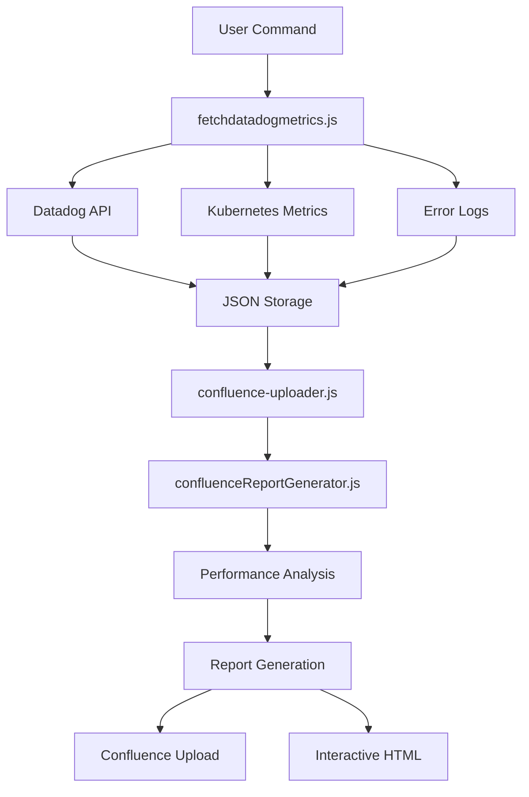

# Automated Performance Reporting POC

## Overview
Automated system to fetch Datadog performance metrics and generate professional Confluence reports with interactive visualizations.

## Setup Instructions

### Prerequisites
- Node.js (v14 or higher)
- npm
- Datadog API access
- Confluence API access

### 1. Install Dependencies
```bash
npm install
```

### 2. Environment Configuration
Create a `.env` file in the project root with your API credentials:
```env
# Datadog Configuration
DATADOG_API_KEY=your_datadog_api_key
DATADOG_APP_KEY=your_datadog_app_key

# Confluence Configuration
CONFLUENCE_USERNAME=your_confluence_email
CONFLUENCE_API_TOKEN=your_confluence_api_token
CONFLUENCE_SPACE_KEY=your_space_key

# Load Pattern Configuration
LOAD_PATTERN=To simulate the throughput 0.1 req/sec over the duration of 30 minutes.
```

⚠️ **Important**: Never commit the `.env` file to version control as it contains sensitive API keys.

## Features

### ✅ Automated Data Collection
- Fetches metrics from Datadog API for any service
- Collects P95/P99 latency, request rates, and error rates
- Generates time series data (data points per endpoint)
- Supports custom date/time ranges

### ✅ Professional Confluence Reports
- Auto-uploads formatted reports to Confluence
- Clean, professional styling with badges and color coding
- Expandable sections for individual endpoints
- Interactive charts embedded via QuickChart.io
- Automatic page creation or updates

### ✅ Interactive HTML Reports
- Standalone HTML with Chart.js visualizations
- Real-time hover tooltips for data points
- Scatter plot: P95 vs Request Rate correlation
- Time series charts for each endpoint
- Fully portable - share via email or web hosting

## Quick Start

### 1. Fetch Metrics from Datadog
```bash
node fetchdatadogmetrics.js --from 'Jan 3, 2:37 pm' --to 'Jan 3, 3:09 pm' --service 'stardust-activity-log-service'
```

**Parameters:**
- `--from`: Start date/time (e.g., 'Jan 13, 1:25 pm')
- `--to`: End date/time (e.g., 'Jan 13, 1:56 pm')
- `--service`: Service name (e.g., 'stardust-closing-requirements-service')

**Output:**
- JSON file saved to `./reports/[service]_endpoint_metrics_table.json`
- Contains metrics for all endpoints with time series data

### 2. Upload to Confluence
```bash
node confluence-uploader.js
```

**What it does:**
- Auto-detects latest metrics file
- Generates interactive HTML report
- Uploads Confluence page with formatted content
- Attaches interactive HTML as downloadable file

**Optional parameters:**
```bash
node confluence-uploader.js --input "reports/specific_file.json" --title "Custom Title"
```

### 3. Generate Standalone Interactive HTML (Optional)
```bash
node generate-full-interactive-report.js
```

Creates `complete-interactive-report.html` with Chart.js visualizations.

## Report Components

### Confluence Report Sections

#### 📊 Header
- **Service Badge**: Blue clickable badge linking to Datadog dashboard
- **Environment Badge**: Green badge (STAGING/PRODUCTION)

#### 🎯 Objective
Brief description of performance testing goals

#### 📋 Test Scope & Design
- **Start Time**: Auto-extracted from metrics
- **End Time**: Auto-extracted from metrics
- **Test Type**: Stress Test (configurable)
- **Duration**: Auto-calculated
- **Design**: Load pattern description (currently static)

#### 📊 Endpoint Performance Summary
Sortable table with:
- Resource Name (endpoint path)
- Requests (total hits)
- P95 Latency
- P99 Latency
- Request Rate
- Errors
- Error Rate

#### 📈 P95 Latency Time Series Analysis
- Scatter plot showing P95 vs Request Rate
- Download link to interactive HTML report

#### 📊 Individual Endpoint Time Series
Expandable sections for each endpoint:
- P95 Latency chart over time (700px width)
- Request Rate chart over time (700px width)
- Both charts with 280px height for optimal Confluence fit

### Interactive HTML Features
- **Scatter Plot**: Visualize latency vs request rate correlation
- **Dual Time Series**: P95 latency + request rate per endpoint
- **Hover Tooltips**: Show exact values on mouse over
- **Responsive Design**: Works on desktop and mobile
- **Color Coded**: Each endpoint has unique color

## Framework Architecture

### 🏗️ System Design Overview

```
Auto Performance Report Framework/
├── 📊 Data Collection Layer
│   ├── fetchdatadogmetrics.js          # Main orchestrator
│   ├── fetch-container-metrics.js      # Kubernetes metrics
│   └── fetch-error-metrics.js          # Error analysis
│
├── 🔄 Processing & Analysis Engine  
│   └── src/scripts/
│       └── confluenceReportGenerator.js # Report generation core
│
├── 📤 Output & Integration Layer
│   ├── confluence-uploader.js          # Confluence API client
│   └── generate-full-interactive-report.js # Interactive HTML
│
├── 📁 Data Storage
│   └── reports/                        # Metrics repository
│       ├── [service]_endpoint_metrics_table.json
│       ├── [service]_container_metrics.json
│       └── [service]_error_metrics.json
│
├── 🔧 Configuration Layer
│   ├── .env                           # API credentials
│   ├── package.json                   # Dependencies & scripts
│   └── .gitignore                     # Security exclusions
│
└── 📖 Documentation
    └── README.md                      # Complete setup guide
```

### 🔄 Data Flow Architecture



### Color Scheme
- **Service Badge**: `#0052CC` (Blue background, white text)
- **Environment Badge**: `#00875A` (Green background, white text)
- **Section Headers**: `#0052CC` (Blue background, white text)
- **Charts**: 10 distinct colors for endpoints

## Key Features

### ✅ Auto-Detection
- Automatically finds latest metrics file
- No need to specify input file paths

### ✅ Dynamic Service Support
- Works with any Datadog service
- Interactive HTML auto-generates for current service
- Service-specific endpoints detected automatically

### ✅ Professional Styling
- Confluence Storage Format (XHTML) compliant
- Consistent badge styling across all sections
- Bold headers with color-coded badges
- Proper chart sizing (700px width) for page fit

### ✅ Error Handling
- Validates configuration before running
- Provides helpful error messages
- Graceful fallbacks for missing data

## Chart Specifications

### QuickChart.io (Confluence Static Charts)
- **Width**: 700px
- **Height**: 280px
- **Type**: Line charts with time series
- **Format**: PNG images embedded via URL

### Chart.js (Interactive HTML)
- **Version**: 3.9.1
- **Adapter**: chartjs-adapter-date-fns 2.0.0
- **Charts**: Scatter + Line (dual axis)
- **Interactivity**: Hover tooltips, legends

## Metrics Collected

### Per Endpoint
- **P95 Latency**: 95th percentile response time
- **P99 Latency**: 99th percentile response time
- **Request Rate**: Hits per second
- **Total Requests**: Total hits during time range
- **Errors**: Error count
- **Error Rate**: Percentage of failed requests

### Time Series Data
- **Data Points**: 180 per endpoint
- **Interval**: ~10 seconds between points
- **Metrics**: Both P95 latency and request rate over time

## Use Cases

### 1. Load Testing Reports
Run load test → Fetch metrics → Auto-generate Confluence report

### 2. Performance Monitoring
Regular snapshots of service performance with visual trends

### 3. Regression Analysis
Compare multiple test runs by generating separate reports

### 4. Stakeholder Communication
Share professional reports with management and teams

## Workflow Example

```bash
# Step 1: Run your load test (external tool like JMeter, Gatling, etc.)

# Step 2: Fetch the metrics from Datadog
node fetchdatadogmetrics.js --from 'Jan 13, 1:25 pm' --to 'Jan 13, 1:56 pm' --service 'stardust-closing-requirements-service'

# Step 3: Upload to Confluence (automatically generates HTML)
node confluence-uploader.js

# Done! Check Confluence for your report
```

## Limitations & Notes

### Static Elements
- Test Type: Currently hardcoded as "Stress Test"
- Design Pattern: Currently shows "1 → 2 → 5 req/sec" static pattern
- These could be made dynamic based on actual load pattern analysis

### Confluence Constraints
- Some HTML styling not supported in macro titles
- Chart width optimization needed for different page layouts
- Attachments replace previous versions (not versioned)

### Datadog API
- Rate limits apply to API calls
- Requires valid API and APP keys
- Service names must match exactly

## Future Enhancements

### Potential Improvements
- [ ] Dynamic load pattern detection from time series data
- [ ] Automatic test type classification (Stress/Spike/Soak)
- [ ] Comparison with baseline/previous tests
- [ ] Alert thresholds and SLA validation
- [ ] Multiple environment support (prod vs staging comparisons)
- [ ] Historical trend analysis
- [ ] PDF export option

## Support

### Common Issues

**Issue**: "No metrics files found"
- **Solution**: Run `fetchdatadogmetrics.js` first to generate metrics

**Issue**: "Confluence upload failed"
- **Solution**: Check `.env` file for correct API credentials

**Issue**: "Interactive HTML shows wrong service"
- **Solution**: System auto-detects latest file. Run `node generate-full-interactive-report.js` after fetching new metrics

## Dependencies

```json
{
  "axios": "^1.6.0",
  "dotenv": "^16.0.0"
}
```

## Technologies Used
- **Node.js**: Script execution
- **Datadog API**: Metrics collection
- **Confluence REST API**: Report publishing
- **QuickChart.io**: Static chart generation
- **Chart.js**: Interactive visualizations
- **Storage Format (XHTML)**: Confluence markup

---

**Created**: January 2026  
**Status**: POC (Proof of Concept)  
**Maintainer**: Performance Testing Team
